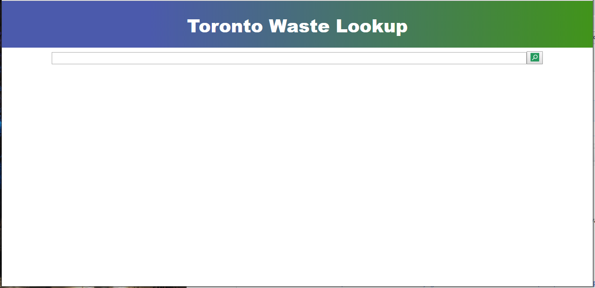
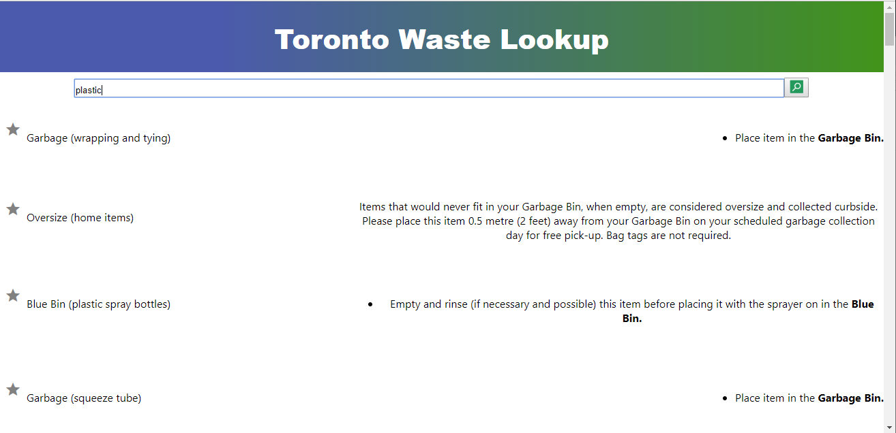
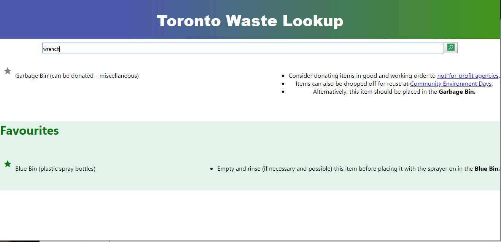
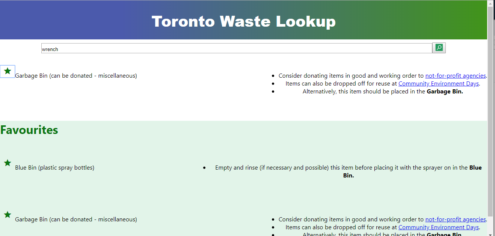

# Functions:

Search for keywords such as clothes or plastics and Waste Lookup will search for the topics relevant to your search.
Favorite a certain item by clicking on the gray star and it will populate on the bottom of the page.
Remove favorite item by clicking on the green star in either search results or favorites list.

# Screenshots:

## Main Page:

`This page contains a search bar which searches through the relevant topics from the Waste Lookup database.`

## Search:

`The results of the search is displayed in a list containing a favorite icon to save the item, the item name and the description.`

## Favorites

`After favoriting an item, the item will appear at the bottom of the page under the favorites heading.`

`Clicking the favorites icon will also cause the favorites icon to change colors. Press the favorite icon in either the favorite bar or the list to unfavorite the item.`

# References:

Information is from "https://www.toronto.ca/city-government/data-research-maps/open-data/open-data-catalogue/#5ed40494-a290-7807-d5da-09ab6a56fca2"
